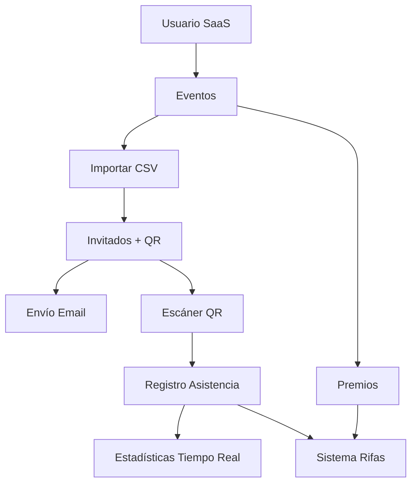

# 🎯 QR Eventos Grupo México - Estado del Proyecto

## 📋 Resumen del Proyecto

**QR Eventos Grupo México** es un SaaS (Software as a Service) diseñado para la gestión integral de eventos corporativos con códigos QR, control de asistencia en tiempo real y sistema de rifas automatizado.

---

## 🎯 Requerimientos Iniciales Solicitados

### 1. **Sistema SaaS Multi-Usuario**
- ✅ Registro y autenticación de usuarios
- ✅ Cada usuario puede crear múltiples eventos independientes

### 2. **Gestión de Eventos**
- ✅ CRUD completo de eventos por usuario
- ✅ Configuración de eventos (fecha, hora, ubicación, etc.)

### 3. **Importación Masiva de Invitados**
- 🔄 Importación desde CSV con campos específicos:
  - Nombre, ApellidoP, ApellidoM
  - NumeroEmpleado, AreaLaboral
  - PremiosRifa (categorías a las que puede acceder)

### 4. **Sistema de Códigos QR**
- ✅ Generación automática de QR único por invitado
- ✅ QR contiene datos del invitado (excepto PremiosRifa por seguridad)
- 🔄 Envío automático por email

### 5. **Control de Asistencia en Tiempo Real**
- 🔄 Escáner de códigos QR para registrar asistencia
- 🔄 Estadísticas de asistencia en tiempo real
- 🔄 Dashboard con métricas actualizadas

### 6. **Sistema de Premios y Rifas**
- ✅ Registro de premios con stock
- 🔄 Sistema de rifas por categorías del CSV
- 🔄 Solo invitados con asistencia confirmada pueden participar
- 🔄 Control de stock de premios

---

## ✅ Lo Que Se Ha Implementado

### **Base de Datos**
```sql
✅ Tabla users (usuarios del sistema)
✅ Tabla events (eventos por usuario)
✅ Tabla guests (invitados con QR)
✅ Tabla prizes (premios por evento)
✅ Tabla attendances (registro de asistencia)
✅ Tabla raffle_entries (participaciones en rifas)
```

### **Modelos Eloquent**
```php
✅ User - Relación con eventos
✅ Event - Gestión de eventos con estadísticas
✅ Guest - Invitados con generación automática de QR
✅ Prize - Premios con control de stock
✅ Attendance - Registro de asistencia
✅ RaffleEntry - Participaciones en rifas
```

### **Servicios**
```php
✅ QrCodeService - Generación, validación y gestión de QR codes
```

### **Dependencias Instaladas**
```json
✅ Laravel Framework 12.31.1 (última versión)
✅ Laravel Breeze (autenticación con React + Inertia)
✅ endroid/qr-code (generación de códigos QR)
✅ maatwebsite/excel (manejo de CSV/Excel)
```

### **Estructura del Proyecto**
```
✅ Migraciones completas con relaciones
✅ Modelos con métodos útiles y relaciones
✅ Controladores base creados
✅ Configuración de base de datos MySQL
✅ Sistema de autenticación configurado
```

---

## 🔄 En Progreso / Pendiente de Implementar

### **Controladores (0% - Pendiente)**
- [ ] **EventController** - CRUD completo de eventos
- [ ] **GuestController** - Gestión e importación de invitados
- [ ] **AttendanceController** - Escaneo QR y registro de asistencia
- [ ] **RaffleController** - Sistema de rifas
- [ ] **PrizeController** - Gestión de premios

### **Frontend React (0% - Pendiente)**
- [ ] **Dashboard principal** con estadísticas generales
- [ ] **Gestión de eventos** (crear, editar, eliminar)
- [ ] **Importación CSV** con validación y preview
- [ ] **Escáner QR** para control de asistencia
- [ ] **Sistema de rifas** en tiempo real
- [ ] **Gestión de premios** y stock

### **APIs y Endpoints (0% - Pendiente)**
- [ ] **API REST** para operaciones CRUD
- [ ] **WebSockets/Broadcasting** para tiempo real
- [ ] **Endpoints de estadísticas** en tiempo real
- [ ] **API de escaneo QR** con validaciones

### **Servicios Adicionales (25% - En progreso)**
- [x] QrCodeService (implementado)
- [ ] **EmailService** - Envío de QR por correo
- [ ] **CsvImportService** - Importación masiva con validaciones
- [ ] **StatisticsService** - Cálculo de métricas en tiempo real
- [ ] **RaffleService** - Lógica de sorteos

### **Sistema de Emails (0% - Pendiente)**
- [ ] **Templates de email** para envío de QR
- [ ] **Cola de emails** para envío masivo
- [ ] **Configuración SMTP**
- [ ] **Tracking de emails enviados**

### **Funcionalidades Avanzadas (0% - Pendiente)**
- [ ] **Tiempo real con WebSockets** (Laravel Reverb/Pusher)
- [ ] **Exportación de reportes** (PDF/Excel)
- [ ] **Sistema de roles** y permisos
- [ ] **Audit logs** para trazabilidad
- [ ] **API móvil** para escáner desde smartphone

---

## 🏗️ Arquitectura del Sistema



---

## 📊 Estado de Completitud

| Componente | Estado | Progreso | Prioridad |
|-----------|---------|----------|-----------|
| 🗄️ Base de Datos | ✅ Completo | 100% | ✅ Alta |
| 🎯 Modelos | ✅ Completo | 100% | ✅ Alta |
| 🔧 Servicios Base | 🔄 Parcial | 25% | 🟡 Alta |
| 🎮 Controladores | ❌ Pendiente | 0% | 🔴 Crítica |
| 🎨 Frontend React | ❌ Pendiente | 0% | 🔴 Crítica |
| 📡 APIs | ❌ Pendiente | 0% | 🔴 Crítica |
| 📧 Sistema Email | ❌ Pendiente | 0% | 🟡 Media |
| 📊 Tiempo Real | ❌ Pendiente | 0% | 🟡 Media |

---

## 🚀 Próximos Pasos Recomendados

### **Fase 1: Core Functionality (Crítica)**
1. **Implementar controladores principales**
2. **Crear importador CSV funcional**
3. **Desarrollar frontend básico con React**
4. **Sistema de escaneo QR básico**

### **Fase 2: Funcionalidad Avanzada (Alta)**
1. **Sistema de emails automático**
2. **Dashboard en tiempo real**
3. **Sistema de rifas completo**
4. **Estadísticas avanzadas**

### **Fase 3: Optimización (Media)**
1. **Performance y caching**
2. **Sistema de roles avanzado**
3. **API móvil**
4. **Reportes y exportaciones**

---

## 🛠️ Comandos de Desarrollo

### **Base de Datos**
```bash
# Ejecutar migraciones
php artisan migrate

# Rollback migraciones
php artisan migrate:rollback

# Refresh completo
php artisan migrate:fresh
```

### **Desarrollo**
```bash
# Servidor Laravel
php artisan serve

# Compilar frontend
npm run dev

# Generar clave de aplicación
php artisan key:generate
```

### **Testing**
```bash
# Ejecutar tests
php artisan test

# Crear test
php artisan make:test EventTest
```

---

## 📝 Notas Técnicas

### **Stack Tecnológico**
- **Backend**: Laravel 12.31.1 + PHP 8.4
- **Frontend**: React + Inertia.js + Tailwind CSS
- **Base de Datos**: MySQL
- **Autenticación**: Laravel Breeze
- **QR Codes**: endroid/qr-code
- **CSV Processing**: maatwebsite/excel

### **Estructura de Archivos Clave**
```
app/
├── Models/           # Modelos Eloquent ✅
├── Http/Controllers/ # Controladores (pendiente)
├── Services/         # Servicios especializados
└── Mail/             # Templates de email (pendiente)

database/
├── migrations/       # Migraciones completas ✅
└── seeders/          # Seeders (pendiente)

resources/
├── js/               # Componentes React (pendiente)
└── views/            # Vistas Inertia (pendiente)
```

---

## 🎯 Objetivos del Proyecto

**Crear un SaaS completo que permita:**
1. ✅ Gestión multi-usuario de eventos
2. 🔄 Importación masiva desde CSV
3. 🔄 Generación automática de QR codes
4. 🔄 Control de asistencia en tiempo real
5. 🔄 Sistema de rifas inteligente
6. 🔄 Estadísticas y reportes avanzados

---

*Documento actualizado: 24 de septiembre de 2025*
*Estado actual: **Fundación sólida establecida - Listo para desarrollo de funcionalidades***